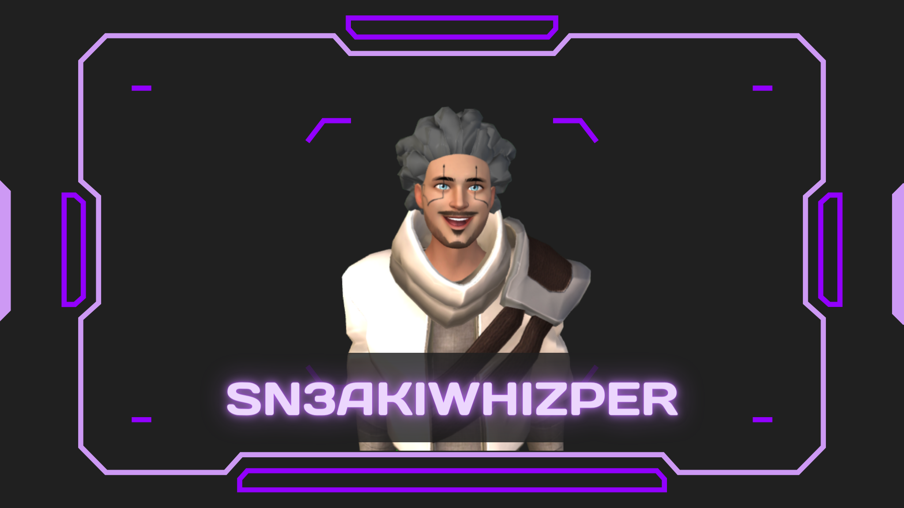
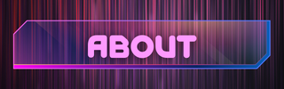
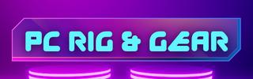

<!-- 
 -->

 

<table>
  <tbody>
    <tr valign="top">
      <td width="50%" align="center">
        <!-- 𝗛𝗧𝗠𝗟𝟱    -->
        
      </td>
      <td width="50%" align="center">
        
      </td>
    </tr>
    <tr valign="top">
      <td width="25%" align="center">
        <!-- 𝗛𝗧𝗠𝗟𝟱    -->
        
        <ul style="list-style-type:none;">
          <li>👋 Hi, I’m @sn3akiwhizper</li>
          <li>Pronounced "sneaky whisper"</li>
          <li>Aspiring creator 📺 (VR & pancake)</li>
          <li>I make mods for VR games</li>
          <li>Internet person/VTuber 💾</li>
          <li>Lifelong Gunter 🥚</li>
          <li>I have a blog too... <a href="https://sn3akwhizper.github.io">Glob</a></li>
        </ul>
           
      </td>
      <td width="25%" align="center">
        Coming Soon!   
      </td>
    </tr>
  </tbody>
</table>

<table>
  <tbody>
    <tr valign="top">
      <td width="33%" align="center">
        <!-- 𝗛𝗧𝗠𝗟𝟱    -->
        
      </td>
      <td width="33%" align="center">
        
      </td>
      <td width="33%" align="center">
        
      </td>
    </tr>
    <tr valign="top">
      <td width="33%" align="center">
        
      </td>
      <td width="33%" align="center">
        
      </td>
      <td width="33%" align="center">
        
      </td>
    </tr>
  </tbody>
</table>

 

<!--  -->

## Current Projects

- VR Home, my personal "Oasis"
- Contractor\$ Mod contest

- VR
  - Headset: Oculus Quest 2
  - Mic: Antlion Mounted Microphone
- Avatar
  - Tracking and animation with Animaze
  - Model & rig generated by [ReadyPlayerMe](https://readyplayer.me/)
  - Face tracking with iPhone 11
  - Hand tracking with Ultraleap hand tracker
- PC Stats
  - MOBO:
  - CPU: AMD Ryzen 7 1700
  - Graphics: NVIDIA GeForce GTX 980Ti
  - Memory: 64GB ???MHz memory XD
- Streaming Setup
  - Audio Manager: Voicemeeter Potato
  - Microphone: Maono ???
- Previous headset: HTC Vive Original

<!---
sn3akiwhizper/sn3akiwhizper is a ✨ special ✨ repository because its `README.md` (this file) appears on your GitHub profile.
You can click the Preview link to take a look at your changes.
--->
